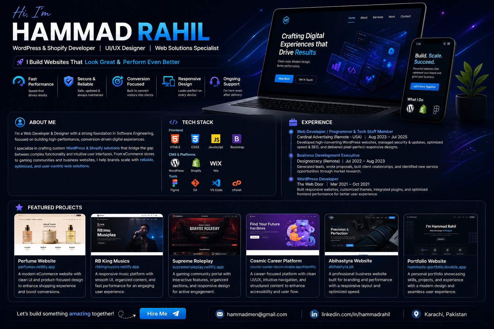

## 🧭 About Me

I’m a **Web Developer & UI/UX Designer** with a strong background in **Software Engineering**, focused on building high-performance, conversion-driven digital experiences.

I specialize in crafting **custom WordPress & Shopify solutions** that combine solid backend functionality with clean, user-friendly interfaces. My work focuses on speed, responsiveness, and turning visitors into customers.

With experience across **eCommerce, business websites, and community platforms**, I help brands scale by delivering reliable, optimized, and visually engaging web solutions.

---

## 🛠️ Tech Stack

### 🚀 Frontend

### 🧩 CMS & Platforms

### 🎨 Tools

---

## 💼 Experience

### 🧑‍💻 Web Developer / Programmer & Tech Staff Member  
**Cardinal Advertising (Remote - USA)**  
📅 Aug 2023 – Jul 2025  
- Developed high-converting WordPress websites for marketing campaigns  
- Managed site performance, security, and plugin integrations  
- Improved SEO structure and loading speed for better visibility  
- Translated design concepts into pixel-perfect, responsive layouts  

---

### 💼 Business Development Executive  
**Designocracy (Remote)**  
📅 Jul 2022 – Aug 2023  
- Generated and qualified leads to grow client base  
- Wrote proposals and managed client communication  
- Built long-term relationships and improved project acquisition  
- Conducted market research for new service opportunities  

---

### 🌐 WordPress Developer  
**The Web Door**  
📅 Mar 2021 – Oct 2021  
- Built responsive websites using CSS & Bootstrap  
- Customized themes and implemented plugins  
- Optimized frontend performance and usability  
- Collaborated with designers for pixel-perfect implementation  

---

## 📊 GitHub Stats

  
  

---

## 🚀 Featured Projects

### 🔹 Perfume Website  
🌐 https://perfumew.netlify.app/  
A modern eCommerce-style website with clean UI, smooth navigation, and product-focused layout designed to improve user engagement and conversions.

---

### 🔹 RB King Musics  
🌐 https://rbkingmusics.netlify.app/  
A responsive music platform with structured content layout, fast loading performance, and an engaging user interface for seamless browsing.

---

### 🔹 Supreme Roleplay  
🌐 https://supremeroleplay.netlify.app/  
A gaming community portal featuring interactive sections, organized content, and a responsive design tailored for active user engagement.

---

### 🔹 Cosmic Career Platform  
🌐 https://cosmic-career-bloom.lovable.app/#identity  
A modern career platform with clean UI/UX, intuitive navigation, and structured content designed to enhance user experience and accessibility.

---

### 🔹 Abihastyra Website  
🌐 https://abihastyra.pk/  
A business website focused on branding, performance, and responsiveness, delivering a professional online presence with optimized speed.

---

### 🔹 Portfolio Website  
🌐 https://hammads-portfolio.lovable.app/  
A personal portfolio showcasing skills, projects, and experience with a modern layout, smooth UI, and responsive design.

---

## 📈 What I Do Best

✔ WordPress & Shopify Development  
✔ UI/UX Design (Figma)  
✔ Website Speed Optimization  
✔ Bug Fixing & Maintenance  
✔ Conversion-Focused Design  

---

## 🌐 Connect With Me

  
  

---

## ⚡ Fun Touch

  

---

⭐ *"Building websites that don’t just look good — but perform."*
